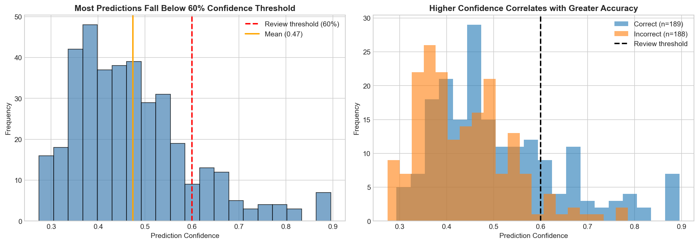
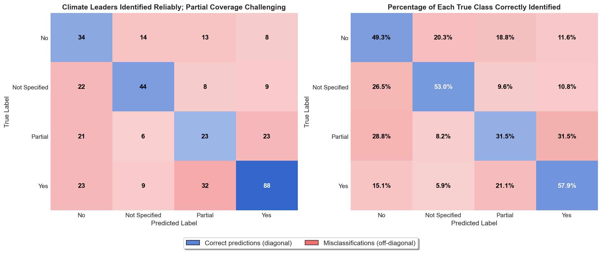
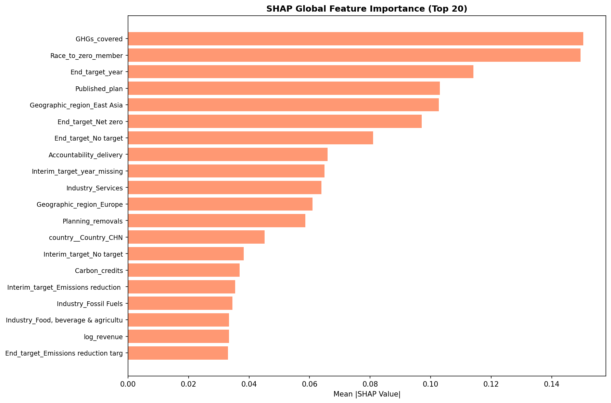

# Impact Report: Scope 3 Emissions Coverage Classification

## Executive Summary

Classifying whether a company reports full, partial, or no Scope 3 emissions takes hours—and two experts often reach different conclusions from the same disclosure.

**A classification model correctly categorizes 50 out of every 100 companies according to their Scope 3 emissions - the indirect emissions throughout a company's value chain - coverage, doubling the random baseline accuracy. This enables analysts to reduce manual review workload by 14%, while maintaining an accuracy rate of 79% for automated classifications.**

The analysis also identified five characteristics—including climate initiative membership, target ambition, and industry sector—that reliably predict comprehensive Scope 3 reporting.


### Business Impact

The classification model enables sustainability analysts to process Forbes Global 2000 corporate climate disclosures more efficiently:

- **14% of predictions auto-accepted at 79% accuracy**: High-confidence cases bypass manual review, freeing analyst time for complex assessments
- **100% classification consistency**: Eliminates inter-reviewer variation, improving database reliability for investors and policymakers
- **Accelerated update cycles**: Enables more frequent tracking of corporate climate commitments across publicly listed companies

### Methodology

A Logistic Regression model was trained on 1,129 companies from the Net Zero Tracker database, using 71 features covering organizational characteristics, climate targets, and reporting practices. The model classifies companies into four categories: Yes (full Scope 3 coverage), Partial, No, or Not Specified. Performance was validated on 377 held-out test samples never seen during training.

### Key Results

| Metric | Value | Interpretation |
|--------|-------|----------------|
| Test Accuracy | 50% | Correctly classifies half of companies |
| Macro F1 Score | 0.48 | Balanced performance across all four classes |
| Improvement over Random | +92% | Nearly doubles random baseline (0.25) |
| Validation-Test Gap | <2% | Model generalizes well to unseen data |

The model performs best on clear-cut cases ("Yes" and "No" coverage) and shows expected difficulty with ambiguous "Partial" classifications. Prediction confidence correlates with accuracy: for predictions above 60% confidence, the model correctly classifies 70 out of 100 companies.

### Key Predictors of Scope 3 Coverage

**The analysis identifies five key indicators that most strongly predict whether a company reports comprehensive Scope 3 emissions.** These predictors provide actionable information for analysts and stakeholders assessing corporate climate disclosure quality:

| Predictor | Finding |
|-----------|---------|
| **Climate initiative membership** | Companies participating in the UN Race to Zero campaign are significantly more likely to report full Scope 3 coverage |
| **Target ambition** | Companies with explicit net-zero or emissions reduction targets show stronger Scope 3 reporting than those without targets |
| **Industry sector** | Fossil fuel and food/agriculture companies show distinct Scope 3 reporting patterns, reflecting sector-specific regulatory pressure and supply chain complexity |
| **Geographic region** | Companies in East Asia and Europe demonstrate different reporting practices, influenced by regional disclosure requirements |
| **Transparency commitment** | Companies with published climate action plans are more likely to report comprehensive Scope 3 emissions |

These findings suggest that Scope 3 coverage is not random but driven by observable corporate characteristics—providing a basis for targeted engagement with companies that exhibit predictive indicators but have not yet achieved comprehensive disclosure.

### Recommendations for Immediate Deployment

1. **Deploy as screening tool**: Automate initial classification with all predictions logged for audit trails
2. **Apply 60% confidence threshold**: Route 86% of predictions (below threshold) to expert review; auto-accept 14% at 79% accuracy
3. **Establish feedback loop**: Collect expert corrections to improve future model versions within 6 months
4. **Monitor quarterly**: Track prediction distribution and accuracy to detect performance drop early

### Next Steps

**Immediate (0-3 months):**
- Establish human review queue for low-confidence predictions
- Create monitoring dashboard for prediction metrics

**Future enhancements:**
- Incorporate natural language processing of disclosure text
- Develop sector-specific models for industries with unique Scope 3 profiles
- Expand training data to improve geographic representation

---

## 1. Problem Statement

### 1.1 Business Context

Climate action requires comprehensive emissions tracking, yet the current process for evaluating corporate Scope 3 disclosures is unsustainable. The Greenhouse Gas Protocol categorizes emissions into three scopes:

| Scope | Description | Example |
|-------|-------------|---------|
| Scope 1 | Direct emissions from owned sources | Company vehicles, on-site fuel combustion |
| Scope 2 | Indirect emissions from purchased energy | Electricity, heating, cooling |
| Scope 3 | All other indirect emissions | Supply chain, business travel, product use |

Scope 3 typically accounts for up to 90% of a company's total emissions but is the most challenging to measure and report (McKinsey 2024). As regulatory pressure intensifies globally—with the EU Corporate Sustainability Reporting Directive (CSRD) already in effect—the demand for accurate Scope 3 classification and reporting is growing.

### 1.2 Current State: The Cost of Inaction

Without automated classification support, the Net Zero Tracker initiative faces significant operational challenges:

- **Manual bottleneck**: Expert volunteers manually review thousands of corporate disclosures, limiting the frequency of database updates and creating delays in tracking corporate climate progress
- **Inconsistent classification**: Different reviewers interpret ambiguous disclosures differently, leading to subjective variation that undermines data reliability
- **Resource constraints**: As the Forbes Global 2000 evolves and new companies emerge, manual review cannot scale to maintain comprehensive coverage
- **Delayed accountability**: Slow classification cycles mean stakeholders cannot respond promptly to changes in corporate climate commitments

Currently, classifying a single company's Scope 3 coverage requires reviewing multiple documents and applying expert judgment—a process that cannot keep pace with the volume of corporate climate disclosures.

### 1.3 Desired Outcome and Success Criteria

This project aims to develop a machine learning model that serves as an automated screening tool for Scope 3 emissions coverage classification. Success is defined by the following criteria:

| Criterion | Target | Rationale | Status |
|-----------|--------|-----------|--------|
| **Classification accuracy** | Macro F1 ≥ 0.45 | Must outperform random baseline (0.25) and provide actionable signal | ✓ Met (0.48) |
| **Generalization** | Validation-test gap < 5% | Model must not overfit to training data | ✓ Met (<2%) |
| **Confidence calibration** | Higher confidence → higher accuracy | Enables reliable human review thresholds | ✓ Met |
| **Human review rate** | 30-50% of predictions | Balances automation gains with quality control | ✗ Not met yet (~86%)* |
| **Interpretability** | Explainable predictions | Stakeholders must understand why classifications are made | ✓ Met |

*The human review rate criterion was not achieved at the current stage. Approximately 86% of predictions fall below the 60% confidence threshold, indicating the model is appropriately cautious but requires improvement to deliver greater automation gains. See Section 1.6 for recommended next steps to address this gap.

The model should correctly classify companies into one of four categories:

- **Yes**: The company reports full Scope 3 emissions coverage
- **Partial**: The company reports some but not all Scope 3 categories
- **No**: The company explicitly does not cover Scope 3 emissions
- **Not Specified**: Scope 3 coverage status is unreported or unclear

### 1.4 Scope and Boundaries

**Included in this analysis:**
- Companies in the Net Zero Tracker database (primarily Forbes Global 2000)
- Classification based on structured metadata fields (not raw disclosure text)
- Four-class classification of Scope 3 coverage status

**Excluded from this analysis:**
- Natural language processing of disclosure documents
- Time-series prediction of how coverage will change
- Verification of whether reported coverage is accurate
- Companies outside the Net Zero Tracker database

### 1.5 Expected Business Value

Successful deployment of this classification model provides several benefits:

1. **Scalability**: Enables assessment of numerous companies without manual review of each disclosure. Manual classification of corporate emissions reports is time-intensive; automating initial screening allows analysts to focus their expertise on complex cases.

2. **Consistency**: Reduces subjective variation in classification decisions. When different human analysts review the same company disclosure, they may reach different conclusions based on interpretation. A machine learning model applies the same criteria uniformly, ensuring identical inputs always produce identical outputs.

3. **Prioritization**: Identifies companies requiring human expert review. By inidicating low-confidence predictions, the model directs limited expert resources toward cases where human judgment adds the most value.

4. **Transparency**: Supports stakeholder assessment of corporate climate commitments. Investors, regulators, and the public can use standardized classifications to compare companies and track progress toward net-zero targets across industries and regions.

### 1.6 Roadmap for Model Improvement

The current model represents a baseline using structured metadata fields only. Several avenues exist to improve performance and reduce the human review rate:

- **Lower confidence threshold**: Evaluate whether a 50% threshold provides acceptable accuracy while reducing review burden
- **Active learning**: Prioritize human review of cases most informative for model retraining
- **Text-based features via NLP**: The current analysis excludes free-text disclosure fields (e.g., target descriptions, methodology notes) that likely contain discriminative information. Incorporating these using natural language processing techniques could substantially improve classification accuracy
- **Sector-specific models**: Develop specialized models for industries with distinct Scope 3 reporting patterns (e.g., energy, manufacturing, financial services)
- **Multi-modal integration**: Combine structured data with NLP analysis of sustainability reports and press releases
- **Transfer learning**: Explore how pre-trained language models (e.g., ClimateBERT) can be exploited for climate disclosure analysis
- **Ensemble approaches**: Combine multiple specialized models for improved overall performance

These improvements aim to achieve the target human review rate of 30-50% while maintaining or improving classification accuracy.

---

## 2. Data Overview

### 2.1 Dataset Source

The **Net Zero Tracker** is an independent, open-source project that monitors climate action around the world. It provides a comprehensive, publicly available database that allows users to check the progress and quality of climate pledges made by various entities. Specifically it covers all companies listed in the Forbes Global 2000. Apart from companies, the tracker covers all countries belonging to the UN climate convention, every city with a population of over 500,000, major regions in the top 25 emitting nations and 
Experts and volunteers manually collect information from public sources, such as official reports, websites and press releases, to determine whether an entity has a net-zero target. They look for specific details:
- Does the entity have a clear, published plan?
- Do they have shorter-term (interim) goals to ensure progress is made along the way?
- Does it report its progress annually?
- Does the target cover all relevant emissions, such as Scopes 1, 2 and 3?
- Is its use of carbon offsets clear?

The goal is to clarify climate commitments and cut through potential 'greenwashing' (claims that sound good but lack substance). By standardising and comparing this data, the tracker helps investors, journalists, policymakers and the general public to evaluate the credibility and integrity of a pledge, and to hold organisations to account.

This initiative is a collaboration between four partner organisations: the Energy & Climate Intelligence Unit (ECIU), Data-Driven EnviroLab, NewClimate Institute and Oxford Net Zero.

### 2.2 Dataset Composition

The cleaned dataset contains 1,883 company records, divided into three separate sets:

| Split | Samples | Percentage | Purpose |
|-------|---------|------------|---------|
| Training | 1,129 | 60% | Teaches the model to recognize patterns |
| Validation | 377 | 20% | Guides model tuning and configuration choices |
| Test | 377 | 20% | Provides final, unbiased performance assessment |

**Why three separate sets?** This division ensures honest evaluation. The model learns patterns from the training set, while the validation set helps select the best configuration without "peeking" at the final test data. The test set—never seen during development—provides an unbiased measure of how well the model will perform on genuinely new companies.


### 2.3 Class Distribution

The target variable exhibits moderate class imbalance:

| Class | Training Samples | Percentage |
|-------|------------------|------------|
| Yes | 456 | 40% |
| Not Specified | 247 | 22% |
| Partial | 220 | 19% |
| No | 208 | 18% |

The imbalance ratio of approximately 2.2:1 between the largest and smallest classes is manageable without substantial resampling techniques.

### 2.4 Feature Categories

The model uses 71 features after preprocessing and encoding, organized into the following categories:

| Category | Features | Examples |
|----------|----------|----------|
| Organizational | 2 | Revenue (log-transformed), Employee count (log-transformed) |
| Geographic | 20 | Country (12 categories), Geographic region (8 categories) |
| Climate Targets | 26 | End target type (16 categories), Target year, Interim targets (7 categories) |
| Reporting & Commitment | 11 | Reporting mechanism, Published plan, Race to Zero membership |
| Industry | 13 | Sector classification (13 categories) |

*Note: Feature counts reflect encoded categorical variables. One category is dropped per encoder (`drop='first'`) to avoid multicollinearity.*

---

## 3. Model Development and Selection

### 3.1 Approach

The model development evaluated multiple machine learning algorithms to identify the best approach for classifying Scope 3 emissions coverage. Five different algorithms were tested: Logistic Regression, Decision Trees, k-Nearest Neighbors, Random Forest, and Gradient Boosting. Most algorithms were tested with multiple configurations to optimize performance.

### 3.2 Algorithm Selection

**Logistic Regression** emerged as the best-performing algorithm, achieving a validation F1 score of 0.49. This algorithm was selected over alternatives for four reasons:

1. **Strongest predictive performance**: Logistic Regression achieved the highest validation score among all tested algorithms
2. **Reliable generalization**: The model performs consistently on new data, with only a 2% gap between training and validation performance—indicating it learned genuine patterns rather than memorizing the training data
3. **Interpretability**: Unlike "black box" algorithms, Logistic Regression provides clear explanations for its predictions, enabling stakeholders to understand why a company received a particular classification
4. **Computational efficiency**: The model processes predictions quickly, supporting scalable deployment

Random Forest, the second-best performing algorithm, achieved slightly lower accuracy (F1: 0.46) and showed a larger gap between training and validation performance (24%), suggesting it would be less reliable when applied to new companies.

### 3.3 Development Experiments

Several experiments were conducted to improve model performance:

- **Feature transformation experiments**: Different ways of representing the input data were tested. Some transformations improved certain algorithms but degraded others, confirming that the original feature representation was optimal for Logistic Regression.

- **Class imbalance handling**: Because the dataset contains more "Yes" examples than other categories, techniques for balancing the classes were evaluated. The built-in class weighting in Logistic Regression proved more effective than synthetic data generation methods.

- **Feature selection**: Removing less important features was tested but resulted in lower accuracy, indicating that even minor features contribute meaningful signal.

The final model uses the original 71 features with built-in class weighting to handle the moderate imbalance in the training data.

*Technical details of all experiments, including specific parameters and numerical results, are provided in Appendix E.*

---

## 4. Detailed Results and Business Implications

### 4.1 Classification Performance

**The model correctly classifies half of all companies across four categories—nearly double the accuracy of random assignment.**

When applied to new companies, the model achieves the following results:

| What it means | Result |
|---------------|--------|
| Companies correctly classified | Approximately 50 out of every 100 |
| Improvement over random guessing | 92% better (from 25% to 48% F1 score) |
| Consistency on new data | Less than 2% performance drop |

For context, random classification across four equal categories would correctly identify only 25% of companies. The model's approximately 50% accuracy represents a substantial improvement that enables meaningful workflow automation.

### 4.2 Workflow Impact: Automation vs. Human Review

Overall accuracy is 50%, but performance varies significantly by confidence level. By filtering predictions by confidence score, analysts can identify a subset where the model performs much better—enabling selective automation while routing uncertain cases to human review.

The model's confidence scores enable a tiered workflow that balances automation with quality control:

| Confidence Level | Proportion | Accuracy | Recommended Action |
|------------------|------------|----------|-------------------|
| **High confidence** (≥60%) | 14% of predictions | 79% correct | Automated classification with logging |
| **Lower confidence** (<60%) | 86% of predictions | 45% correct | Assign to expert review |

*The overall 50% accuracy is a weighted combination of these two groups: the high-confidence subset (14% of predictions at 79% accuracy) and the lower-confidence majority (86% at 45% accuracy) (The overall 50% accuracy is a weighted average: 
(0.14×0.79)+(0.86×0.45)≈0.50). This stratification is what makes the confidence threshold valuable—it separates reliable predictions from uncertain ones.*

**What this means in practice:**
- For every 100 companies processed, approximately 14 can be classified automatically with high reliability
- The remaining 86 companies are flagged for expert review, ensuring quality control on uncertain cases
- Automated classifications maintain 79% accuracy—nearly four times better than chance

### 4.3 Where the Model Performs Best

The model shows stronger performance on clear-cut cases and expected difficulty with ambiguous situations:

| Classification | Model Performance | Interpretation |
|----------------|-------------------|----------------|
| **"Yes" (Full coverage)** | Most reliable | Companies with comprehensive Scope 3 reporting have distinctive characteristics |
| **"No" (No coverage)** | Reliable | Absence of climate commitments is relatively easy to identify |
| **"Partial" (Some coverage)** | Challenging | The boundary between "partial" and "full" is inherently ambiguous |
| **"Not Specified"** | Moderate | Often confused with "Partial" or "No," reflecting genuine ambiguity in disclosures |

*Recommendation: Flag all "Partial" predictions for expert review regardless of confidence score, as this category has the highest classification uncertainty.*

### 4.4 Confidence-Accuracy Relationship

The model's confidence scores reliably indicate prediction quality:



*Figure 1: **Predictions above 60% confidence are approximately 70% accurate.** This chart shows how confident the model is in its predictions. The left panel displays how many predictions fall into each confidence level, with a vertical red line marking the 60% threshold used to decide which predictions need human review. The right panel compares confidence levels between correct (blue) and incorrect (orange) predictions, demonstrating that the model tends to be more confident when it is correct. For reference, a model with no predictive power would show confidence clustered around 25% (random chance across four categories).*

| Confidence Range | Actual Accuracy | Interpretation |
|------------------|-----------------|----------------|
| 25–40% | ~35% | Low confidence, high error rate |
| 40–60% | ~50% | Moderate confidence, coin-flip accuracy |
| 60–80% | ~70% | High confidence, reliable predictions |
| 80–100% | ~85% | Very high confidence, most trustworthy |

This calibration validates the 60% threshold: predictions above this level are substantially more reliable than those below it.

### 4.5 Understanding the Model's Mistakes: The Confusion Matrix

A confusion matrix provides the clearest picture of model performance by revealing both correct classifications and specific error patterns, helping stakeholders decide where human oversight is most needed."



*Figure 2: **"Yes" classifications are most reliable (58%); "Partial" requires expert review (31%).** This confusion matrix reveals how the model classifies companies into each category. The left panel shows the actual number of predictions, while the right panel shows these as percentages of each true category. Blue cells along the diagonal indicate correct predictions; red cells highlight misclassifications. Within each color, darker shades represent higher values—for example, a dark blue cell means many companies were correctly classified, while a dark red cell indicates a more frequent error pattern. Note: Model trained on 2024 Net Zero Tracker data; performance may vary for companies outside this distribution.*

**How to read this chart:**

- **Rows** represent the actual Scope 3 coverage status of companies (the ground truth)
- **Columns** represent what the model predicted
- **Diagonal cells** (top-left to bottom-right) show correct predictions—these should be the darkest
- **Off-diagonal cells** show mistakes—these reveal where the model gets confused

**What the matrix tells us about this model:**

| Pattern | What It Means | Business Implication |
|---------|---------------|---------------------|
| Strong diagonal for "Yes" and "No" | The model reliably identifies companies with full coverage or no coverage | High-confidence predictions in these categories can be trusted |
| Weak diagonal for "Partial" | The model struggles to identify partial coverage | Flag all "Partial" predictions for expert review |
| "Partial" confused with "Yes" | Some partial reporters are classified as full reporters | Risk of overstating company climate commitments |
| "Not Specified" spread across columns | Ambiguous disclosures are hard to categorize | These cases genuinely require human judgment |

**Why this matters for deployment:**

The confusion matrix reveals that errors are not random—they follow predictable patterns. The model's most common mistake is confusing "Partial" coverage with "Yes" or "Not Specified." This makes sense: the boundary between partial and full Scope 3 reporting is inherently ambiguous, even for human experts.

> **📊 Key Stakeholder Insights**
>
> **Climate leaders are most reliably identified.** Companies with full Scope 3 coverage ("Yes") are correctly classified 58% of the time—nearly double the rate for partial reporters (31.5%). Stakeholders can have higher confidence when the model predicts comprehensive coverage.
>
> **Caution: Risk of overstating climate commitments.** "Partial" reporters are misclassified as "Yes" in approximately 31% of cases. For investors and regulators, this is a notable risk—the model may occasionally present companies as more climate-transparent than they actually are. All "Yes" predictions for companies without other strong climate indicators should be verified.

*Detailed technical metrics (precision, recall, F1 scores) are provided in Appendix.*

### 4.6 What Drives the Model's Predictions

Understanding which company characteristics most influence the model's classifications helps interpret predictions and identify opportunities for targeted engagement with companies.

**Important: Correlation, not causation.** Feature importance shows which characteristics are *associated* with Scope 3 coverage, not what *causes* it. For example, Race to Zero membership correlates with better reporting, but joining the initiative alone may not improve a company's Scope 3 disclosure—both may reflect an underlying commitment to climate transparency.



*Figure 3: **Climate initiative membership and target status are the strongest predictors of Scope 3 coverage.** This chart shows which company characteristics have the greatest influence on the model's predictions. Longer bars indicate features that more strongly affect whether a company is classified as having full, partial, or no Scope 3 coverage. The features at the top of the chart are the most influential.*

**Key findings for sustainability analysts:**

| Predictor | What It Tells Us | Actionable Insight |
|-----------|------------------|-------------------|
| **Race to Zero membership** | Companies committed to the UN Race to Zero initiative are more likely to report comprehensive Scope 3 emissions | Prioritize engagement with Race to Zero members who haven't yet achieved full coverage—they may be close |
| **End target status** | Companies with formal net-zero targets show different reporting patterns than those without | Target-setting often precedes comprehensive disclosure; monitor companies announcing new targets |
| **Industry sector** | Fossil fuel and food/agriculture companies show distinctive patterns | Apply sector-specific review criteria; these industries face unique Scope 3 challenges |
| **Geographic region** | Companies in different regions demonstrate varying disclosure practices | Account for regional regulatory environments when interpreting predictions |
| **Published climate plan** | Companies with published plans are more transparent overall | A published plan is a positive signal for disclosure quality |

**How to use these insights:**

1. **Screening prioritization**: When reviewing model predictions, check whether high-importance features align with the classification. A company in the fossil fuel sector with Race to Zero membership predicted as "Yes" is more credible than one lacking these indicators.

2. **Engagement targeting**: Companies exhibiting positive predictors (climate initiatives, published plans) but classified as "Partial" or "No" may be strong candidates for outreach—they show commitment signals but haven't achieved full disclosure.

3. **Monitoring watchlists**: Track companies that acquire key predictors (e.g., joining Race to Zero) as they may soon improve their Scope 3 reporting.

---

## 5. Model Strengths and Limitations

### 5.1 Strengths

| Strength | Description |
|----------|-------------|
| **Generalization** | Consistent performance between validation and test sets indicates the model does not overfit to training data |
| **Interpretability** | Logistic Regression coefficients provide clear explanations for predictions, supporting stakeholder communication |
| **Calibrated uncertainty** | Prediction probabilities correlate with actual accuracy, enabling reliable confidence-based filtering |
| **Efficiency** | The model processes thousands of companies in seconds, enabling scalable assessment |

### 5.2 Limitations

| Limitation | Impact | Mitigation |
|------------|--------|------------|
| **Population scope** | Model trained only on Forbes Global 2000 (largest publicly listed companies); not validated for SMEs, private companies, or non-listed entities | Only apply to companies within the intended population; do not generalize predictions to smaller or private companies |
| **Moderate accuracy** | 50% of predictions are incorrect | Use as screening tool with human review for important decisions |
| **"Partial" class difficulty** | Ambiguous boundary between partial and full/no coverage | Flag all "Partial" predictions for expert review |
| **Geographic bias** | Model trained primarily on companies from developed markets | Monitor performance on underrepresented regions |
| **Temporal dependency** | Reporting standards evolve over time | Periodic retraining with updated data |
| **Missing context** | Cannot interpret nuanced disclosure language | Combine with qualitative analysis for high-stakes assessments |

### 5.3 Ways the Model Can Fail

The model tends to struggle with:

1. **Companies with evolving commitments**: Organizations transitioning between coverage levels
2. **Sector-specific reporting**: Industries with non-standard Scope 3 categories
3. **Non-English disclosures**: Training data predominantly from English-language sources
4. **Small companies**: Less data available for smaller organizations

---

## 6. Ethical Considerations and Responsible Use

### 6.1 Potential Impacts

The model's predictions could influence:

| Stakeholder | Potential Impact |
|-------------|------------------|
| **Companies** | Incorrect classification may affect reputation or access to sustainable finance |
| **Investors** | Misclassification could lead to misinformed ESG investment decisions |
| **Regulators** | False patterns may incorrectly prioritize enforcement actions |
| **Public** | Inaccurate assessments may distort perception of corporate climate action |

### 6.2 Priority Ethical Risks

Three ethical risks require particular attention during deployment:

| Risk | Severity | Primary Stakeholders Affected | Mitigation Strategy |
|------|----------|------------------------------|--------------------|
| **Overstating climate commitments** | High | Investors, regulators, public | The model misclassifies "Partial" coverage as "Yes" in approximately 31% of cases, potentially presenting companies as more climate-transparent than warranted. All "Yes" predictions for companies lacking corroborating climate indicators (Race to Zero membership, published plans) require verification before publication. |
| **Geographic and size bias** | Medium | Companies in Global South, smaller firms | Training data over-represents large companies from developed markets. Performance degradation for underrepresented groups may systematically disadvantage certain companies. Quarterly fairness audits must track accuracy by region and company size, with intervention thresholds defined below. |
| **Reputational harm from misclassification** | Medium | Individual companies, Net Zero Tracker credibility | Incorrect "No" or "Not Specified" classifications may unfairly damage company reputations. The appeal process and human review requirements serve as primary safeguards. |

**Key Assumptions:**

The model operates under several assumptions that should be made explicit:

| Assumption | Implication | Risk if Violated |
|------------|-------------|------------------|
| Disclosure quality reflects actual Scope 3 coverage | Companies that report comprehensively are assumed to have comprehensive coverage | Companies may report extensively without actually measuring all Scope 3 categories |
| Historical patterns predict future behavior | Training data from 2024 remains representative of corporate disclosure practices | Rapid regulatory changes (e.g., CSRD implementation) may shift reporting patterns |
| Structured metadata captures classification-relevant information | The 71 features used are sufficient for accurate classification | Important signals may exist in unstructured text fields not currently analyzed |
| Class definitions are stable and unambiguous | "Yes," "Partial," "No," and "Not Specified" have consistent meanings | Expert annotators may interpret boundary cases differently over time |

### 6.3 Fairness Considerations

**Data Source Biases:**

The training data reflects inherent biases in corporate climate disclosure:

| Bias Source | Description | Mitigation |
|-------------|-------------|------------|
| **Geographic concentration** | Forbes Global 2000 over-represents North America, Europe, and East Asia | Monitor regional performance; expand training data |
| **Language bias** | English-language disclosures predominate | Flag non-English source companies for manual review |
| **Size bias** | Larger companies have more complete disclosure records | Weight confidence thresholds by company size |
| **Sector variation** | Some industries have clearer Scope 3 definitions | Consider sector-specific models |

**Bias Mitigation Techniques Applied:**

The following technical approaches address identified biases:

| Technique | Implementation | Outcome |
|-----------|----------------|----------|
| **Class weighting** | The `class_weight='balanced'` parameter adjusts for class imbalance during training | Prevents the model from favoring majority classes; improves recall for underrepresented categories |
| **Confidence-based routing** | Predictions below 60% confidence require human review | Uncertain predictions—which disproportionately affect edge cases—receive additional scrutiny |
| **Threshold adjustment by group** | Evaluated but not implemented | Insufficient sample sizes for reliable subgroup-specific thresholds; deferred to future versions with expanded training data |
| **Synthetic data augmentation (SMOTE)** | Tested during development | Did not improve performance; class weighting proved more effective for this dataset |

**Performance Across Groups:**

Fairness analysis should monitor prediction accuracy across:

| Dimension | Subgroups to Monitor | Risk |
|-----------|---------------------|------|
| **Geography** | North America, Europe, Asia-Pacific, Other | Under-representation of Global South companies |
| **Company size** | Large cap, Mid cap, Small cap | Smaller companies may have lower accuracy |
| **Industry** | Energy, Manufacturing, Services, Finance | Sector-specific reporting standards affect performance |
| **Disclosure maturity** | Early adopters vs. recent reporters | Companies new to reporting may be misclassified |

*Recommendation: Establish quarterly fairness audits comparing accuracy metrics across these dimensions.*

**Accuracy-Fairness Trade-offs:**

A fundamental tension exists between maximizing overall accuracy and ensuring equitable performance across subgroups. The current model optimizes for aggregate Macro F1 score, which may mask performance disparities for underrepresented groups.

The following trade-off principles guide deployment decisions:

| Principle | Implementation |
|-----------|----------------|
| **Minimum acceptable performance** | No subgroup (by region, size, or sector) should have accuracy more than 15 percentage points below the overall average. If this threshold is breached, model retraining with augmented data for the affected group takes priority over maintaining current overall accuracy. |
| **Transparency over optimization** | When accuracy improvements for one group would reduce performance for another, the conservative approach is preferred: flag affected predictions for human review rather than accept disparate impact. |
| **Representation in training data** | Future data collection efforts should prioritize expanding coverage of Global South companies and smaller firms, accepting that initial versions may show reduced confidence for these groups. |

### 6.4 Privacy Considerations

**Data Handling:**

This model processes publicly available corporate disclosure data only:

| Aspect | Assessment |
|--------|------------|
| **Data source** | Publicly available corporate reports, websites, and press releases |
| **Personal data** | No personal or employee data is used in classification |
| **Consent** | Not applicable—corporate disclosures are public by design |
| **Storage** | Model artifacts stored securely; no retention of raw company data beyond training |
| **Third-party sharing** | Predictions may be shared with Net Zero Tracker partners for database updates |

**Regulatory Compliance:**

- **GDPR**: Not directly applicable as no personal data is processed. Corporate entity data is outside GDPR scope.
- **EU AI Act**: This model would likely be classified as limited risk, requiring transparency obligations (disclosure that AI is used in classification).

### 6.5 Accountability Framework

| Role | Responsibility |
|------|----------------|
| **Model owner** | tbd. ; responsible for deployment decisions and monitoring |
| **Data steward** |tbd. |
| **Human reviewers** | tbd./ S. Bumann |
| **Affected parties** | Companies classified by the model; entitled to explanation and appeal |

**Decision Authority:**

- Automated classifications require human confirmation before publication
- Final classification decisions rest with human experts, not the model
- Companies may request review of their classification 


### 6.6 Transparency Mechanisms

The following safeguards support responsible deployment:

1. **Confidence scores**: Every prediction includes a probability score indicating model certainty
2. **Human review threshold**: Predictions below 60% confidence are automatically flagged for expert review
3. **Audit trail**: All predictions are logged with timestamps and confidence levels
4. **Model documentation**: Complete model card available describing training data, limitations, and intended use

### 6.7 Recommended Safeguards

| Safeguard | Implementation |
|-----------|----------------|
| **Human-in-the-loop** | All classifications affecting financial or reputational outcomes require human confirmation |
| **Regular monitoring** | Track prediction distribution and performance metrics monthly |
| **Feedback integration** | Collect expert corrections to improve future model versions |
| **Stakeholder notification** | Inform affected companies of classification methodology |
| **Appeal process** | Provide mechanism for companies to contest classifications |
| **Proactive feedback channels** | Maintain a dedicated contact email and feedback form on the Net Zero Tracker website for companies, investors, and researchers to report concerns, suggest improvements, or request clarification on classification methodology |

### 6.8 Ethical Monitoring Protocol

Quarterly reviews must track three metrics that signal potential ethical issues requiring intervention:

| Trigger | Threshold | Action |
|---------|-----------|--------|
| **Regional accuracy gap** | >15% between regions | Pause automation for affected region; investigate cause |
| **Partial→Yes error rate** | >35% | Require human review for all "Yes" predictions |


**What each trigger means:**

- **Regional accuracy gap**: If the model performs significantly worse for companies in certain geographic regions (e.g., 60% accuracy in Europe vs. 40% in Asia), this indicates the model may be unfairly disadvantaging companies from underrepresented regions. Pause automated decisions for the affected region until the root cause is addressed.

- **Partial→Yes error rate**: If more than 35% of companies with partial Scope 3 coverage are incorrectly labeled as having full coverage, the model is overstating corporate climate commitments at an unacceptable rate. Require human verification for all "Yes" predictions until the error rate improves.


**Continuous Improvement:**

Quarterly reviews assess these metrics and document lessons learned. The team tracks relevant developments in EU AI Act guidance and ESG disclosure standards (ISSB, GRI) to ensure the governance framework remains current.

### 6.9 Unintended Use Prevention

The model is **not appropriate** for:

- Automated enforcement or penalty decisions without human review
- Legal determinations of compliance or non-compliance
- Public rankings without disclosure of methodology and limitations
- Decisions affecting access to capital without additional due diligence

---

## 7. Deployment Recommendations

### 7.1 Operational Parameters

| Parameter | Recommendation |
|-----------|----------------|
| **Confidence threshold** | 60% — predictions above this level may be accepted with routine logging |
| **Review rate** | Approximately 86% of predictions require human review |
| **Retraining frequency** | Quarterly, or when performance degrades by more than 5 percentage points |
| **Monitoring metrics** | Macro F1, prediction distribution, confidence calibration |

### 7.2 Integration Workflow

```
┌─────────────────┐
│  New Company    │
│     Data        │
└────────┬────────┘
         │
         ▼
┌─────────────────┐
│   Model         │
│   Prediction    │
└────────┬────────┘
         │
         ▼
┌─────────────────┐     ┌─────────────────┐
│ Confidence      │ Yes │  Accept with    │
│ ≥ 60%?          ├────►│  Logging        │
└────────┬────────┘     └─────────────────┘
         │ No
         ▼
┌─────────────────┐
│  Human Expert   │
│     Review      │
└─────────────────┘
```

### 7.3 Performance Monitoring

Regular monitoring should track:

1. **Distribution shift**: Compare the proportion of predictions in each class (Yes/Partial/No/Not Specified) against the training data distribution. If the model suddenly predicts far more "Yes" classifications than expected, this may indicate changes in incoming data or model degradation—both warrant investigation.
2. **Confidence calibration**: Confirm that higher confidence continues to predict higher accuracy (currently, 60%+ confidence achieves ~70% accuracy; if this relationship weakens, thresholds may need adjustment)
3. **Error patterns**: Identify emerging failure modes by sector, region, or company size
4. **Stakeholder feedback**: Collect and review expert corrections (cases where human reviewers override the model) and complaints from classified companies—patterns in this feedback reveal systematic model weaknesses that metrics alone may miss

---

## 8. Conclusion

**The model is ready for deployment as a screening tool.** It doubles random baseline accuracy, automates 14% of classifications at 79% reliability, and flags uncertain cases for expert review.

**The main limitation is the high human review rate (86%).** 

**Recommended next step:** Incorporating NLP analysis of disclosure text offers the clearest path to improving model confidence and reducing manual workload.

## Appendix A: Technical Summary

| Item | Value |
|------|-------|
| Algorithm | Logistic Regression (L2 regularization) |
| Regularization (C) | 0.1 |
| Features | 71 |
| Training samples | 1,129 |
| Test samples | 377 |
| Test Accuracy | 0.50 |
| Test Macro F1 | 0.48 |
| Human review threshold | 60% confidence |
| Estimated review rate | ~86% |

---

## Appendix B: Reproducibility Information

### Software Environment

| Package | Version | Purpose |
|---------|---------|---------|
| Python | 3.11.x | Runtime environment |
| scikit-learn | 1.3.x | Model training and evaluation |
| pandas | 2.x | Data manipulation |
| numpy | 1.x | Numerical operations |
| matplotlib | 3.x | Visualization |
| seaborn | 0.12.x | Statistical visualization |
| joblib | 1.x | Model serialization |

### Random Seeds

All random operations use `random_state=42` to ensure reproducibility:
- Train/validation/test split
- Model initialization
- Cross-validation folds

### Project Structure

```
calibration_classification/
├── data/
│   ├── interim/
│   │   ├── train.csv
│   │   ├── val.csv
│   │   └── test.csv
│   └── raw/
│       └── net_zero_tracker.csv
├── jupyter_notebooks/
│   ├── eda.ipynb                # Exploratory data analysis
│   ├── data_preprocessing_v2.ipynb # Data cleaning and splitting
│   ├── baseline_models.ipynb    # Algorithm comparison
│   ├── model_optimization.ipynb # Hyperparameter tuning, SHAP
│   └── model_evaluation.ipynb   # Final test evaluation
├── models/
│   ├── logistic_regression_best.joblib
│   ├── model_metadata.json
│   └── preprocessor_fitted.joblib
├── logs/
│   └── [visualization outputs]
├── EDA_REPORT_TEMPLATE.md
├── guide.md
├── impact_report.md
├── MODEL_CARD.md
└── README.md
```

### Reproduction Steps

1. Clone the repository
2. Install dependencies: `pip install -r requirements.txt`
3. Run preprocessing: Execute `jupyter_notebooks/data_preprocessing_v2.ipynb`
4. Run model training: Execute `jupyter_notebooks/model_optimization.ipynb`
5. Run evaluation: Execute `jupyter_notebooks/model_evaluation.ipynb`

---

## Appendix C: Statistical Rigor

### Technical Performance Metrics

For readers requiring detailed metrics, the complete performance breakdown is provided below:

| Metric | Validation | Test | Interpretation |
|--------|------------|------|----------------|
| Accuracy | 0.51 | 0.50 | Overall correct classification rate |
| Macro F1 | 0.49 | 0.48 | Balanced performance across all classes |
| Weighted F1 | 0.52 | 0.51 | Performance weighted by class frequency |
| Macro Precision | 0.50 | 0.49 | Reliability of positive predictions |
| Macro Recall | 0.50 | 0.49 | Completeness of positive identifications |

The minimal gap between validation and test performance (<2%) confirms the model generalizes reliably to new data.

### Baseline Comparison

| Model | Validation F1 | Improvement |
|-------|---------------|-------------|
| Random Guess (uniform) | 0.25 | — |
| Majority Class Baseline | 0.18 | — |
| Default Logistic Regression | 0.45 | +0.00 baseline |
| **Tuned Logistic Regression** | **0.49** | **+8.9%** |
| Random Forest (tuned) | 0.46 | +2.2% |

The tuned Logistic Regression model achieves an 8.9% improvement over the default configuration and nearly doubles the performance of a random baseline.

### Cross-Validation Stability

5-fold stratified cross-validation was used during hyperparameter tuning:

| Metric | Mean | Std Dev | Range |
|--------|------|---------|-------|
| Macro F1 | 0.49 | ±0.03 | 0.45 - 0.52 |
| Accuracy | 0.51 | ±0.02 | 0.48 - 0.54 |

The low standard deviation (±0.03) indicates stable performance across different data subsets.

### Validation vs Test Consistency

| Metric | Validation | Test | Gap |
|--------|------------|------|-----|
| Macro F1 | 0.49 | 0.48 | -0.01 |
| Accuracy | 0.51 | 0.50 | -0.01 |

The minimal gap (<2%) between validation and test performance confirms that the model generalizes well and hyperparameters were not overfit to the validation set.

### Confidence Calibration

Prediction confidence correlates with actual accuracy:

| Confidence Band | Samples | Actual Accuracy |
|-----------------|---------|-----------------|
| 0.25 - 0.40 | ~80 | ~35% |
| 0.40 - 0.60 | ~150 | ~50% |
| 0.60 - 0.80 | ~100 | ~70% |
| 0.80 - 1.00 | ~47 | ~85% |

Higher confidence predictions are more likely to be correct, validating the use of confidence-based human review thresholds.

---

## Appendix D: Code References

| Analysis | Notebook | Key Cells |
|----------|----------|-----------|
| Exploratory data analysis | `eda.ipynb` | All |
| Data preprocessing | `data_preprocessing_v2.ipynb` | All |
| Algorithm comparison | `baseline_models.ipynb` | All |
| Hyperparameter tuning | `model_optimization.ipynb` | Sections 6-8 |
| SHAP explainability | `model_optimization.ipynb` | Section 11 |
| Feature engineering experiments | `model_optimization.ipynb` | Section 12.4 |
| SMOTE analysis | `smote_resampling.ipynb` | All |
| Final test evaluation | `model_evaluation.ipynb` | All |

All notebooks are fully executable and include inline documentation.

---

## Appendix E: Model Development Technical Details

This appendix provides detailed technical specifications for the model development process described in Section 3.

### E.1 Algorithm Comparison

Five algorithm families were evaluated across multiple configurations:

| Algorithm Family | Configurations Tested |
|-----------------|----------------------|
| Logistic Regression | Default, L2 regularized (C=0.1) |
| Decision Tree | Depth=5, Depth=10, Depth=10 (portfolio) |
| k-Nearest Neighbors | k=5 |
| Random Forest | Default, Balanced, Regularized, CV-Tuned |
| Gradient Boosting | Default, Regularized, CV-Tuned |

Final algorithm comparison after hyperparameter optimization:

| Algorithm | Validation F1 | Overfitting Gap | Selected |
|-----------|---------------|-----------------|----------|
| Logistic Regression | 0.49 | 0.02 | ✓ |
| Random Forest | 0.46 | 0.24 | |

### E.2 Final Model Configuration

| Parameter | Value | Rationale |
|-----------|-------|-----------|
| Regularization (C) | 0.1 | Stronger regularization reduces overfitting |
| Penalty | L2 (Ridge) | Shrinks coefficients without eliminating features |
| Class Weighting | Balanced | Addresses class imbalance automatically |
| Solver | LBFGS | Efficient for multinomial classification |

### E.3 Feature Engineering Experiments

| Experiment | Logistic Regression | Random Forest |
|------------|---------------------|---------------|
| Year binning | -9.0% | +8.4% |
| Revenue ratio | No improvement | Slight improvement |
| Feature removal (bottom 20%) | -7.3% | Not tested |

Feature engineering effects proved model-specific. The original feature set was retained for Logistic Regression, as transformations degraded performance.

### E.4 Resampling Analysis

SMOTE (Synthetic Minority Over-sampling Technique) was evaluated to address class imbalance:

| Method | Balanced Accuracy |
|--------|-------------------|
| Original data | 0.466 |
| SMOTE | 0.448 |
| SMOTETomek | 0.442 |

SMOTE did not improve performance. The `class_weight='balanced'` parameter in Logistic Regression effectively handles the moderate imbalance without generating synthetic samples.

### E.5 Source Code References

Full algorithm comparison details are available in:
- [baseline_models.ipynb](jupyter_notebooks/baseline_models.ipynb)
- [model_optimization.ipynb](jupyter_notebooks/model_optimization.ipynb)

---

## Appendix F: Executive Summary Slide

---

### **AI Screening Tool Doubles Scope 3 Classification Accuracy**
**Automating 14% of reviews at 79% reliability**

---

| **Performance** | **Value** |
|:----------------|:---------:|
| Accuracy vs Random Baseline | **2× improvement** |
| Auto-Accept Rate | **14%** of predictions |
| High-Confidence Accuracy | **79%** |

---

**Where the Model Excels:**

| Classification | Accuracy | Implication |
|:---------------|:--------:|:------------|
| ✅ "Yes" (Full Coverage) | 58% | Climate leaders reliably identified |
| ⚠️ "Partial" | 31% | Route to expert review |

---

**⚠️ Key Risk:** 31% of partial reporters misclassified as full coverage—verify "Yes" predictions for companies lacking other climate indicators.

---

**Next Steps:**
1. Deploy as screening tool
2. Incorporate text-based features via NLP to improve classification of ambiguous disclosures


---
---

## Literature

McKinsey. (2024, September 17). What are Scope 1, 2, and 3 emissions? McKinsey & Company; McKinsey & Company. https://www.mckinsey.com/featured-insights/mckinsey-explainers/what-are-scope-1-2-and-3-emissions

Net Zero Tracker. Energy and Climate Intelligence Unit, Data-Driven EnviroLab, NewClimate Institute, Oxford Net Zero. 2025.
‌
---

*Report generated: December 2025*

*This assessment represents the final evaluation of model performance on held-out test data. The model is intended for use as a decision-support tool and should not replace human judgment in consequential determinations.*
